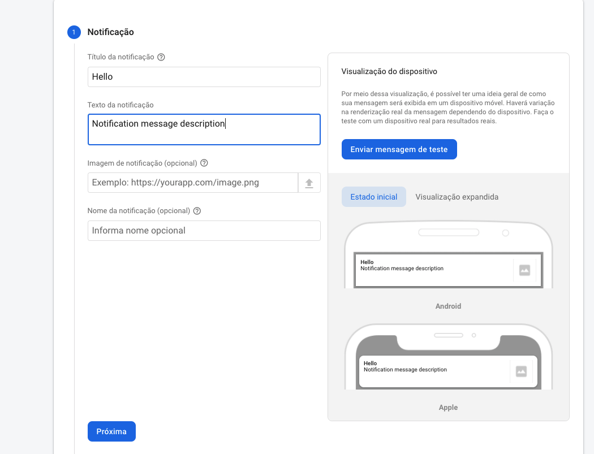
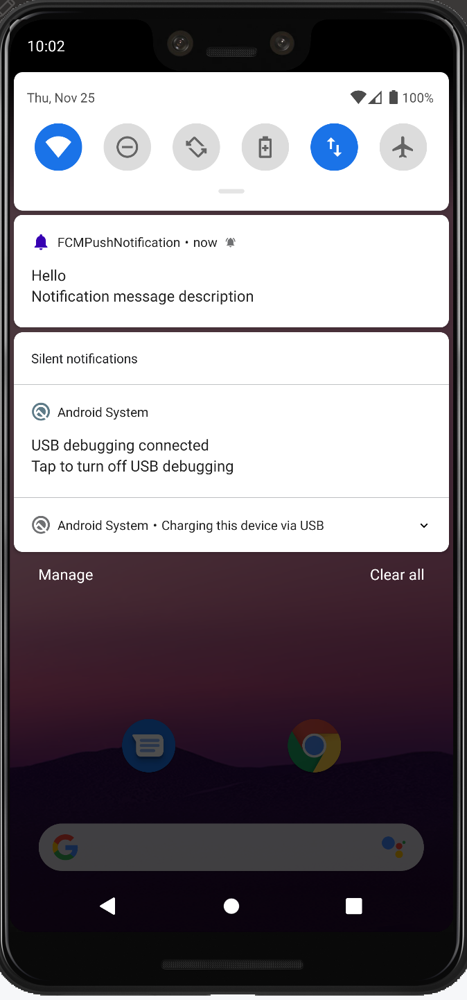
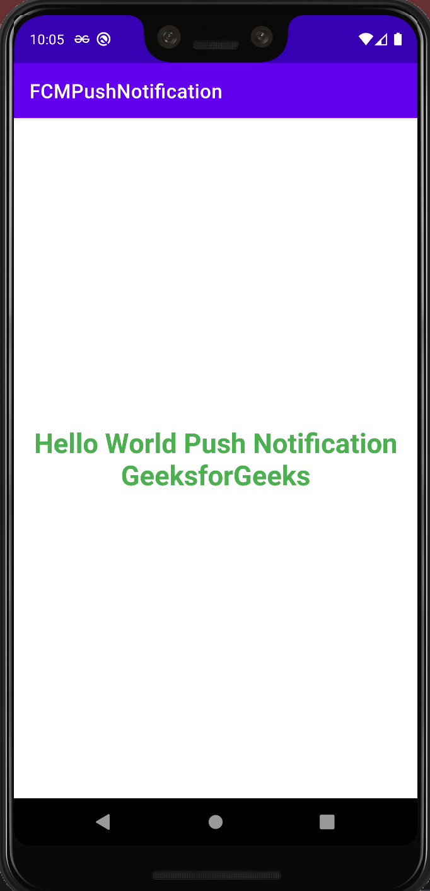

# FireBasePushNotification
## An Android App of how to push a notification from Firebase Messaging Console - FCM

* Kotlin
* Push Notification
* Firebase Cloud Messaging - FCM
* Send notification from Firebase console FCM

 

### Reference
* https://www.youtube.com/watch?v=2xoJi-ZHmNI